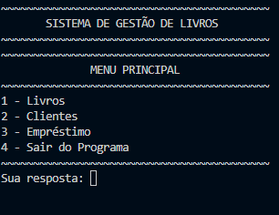
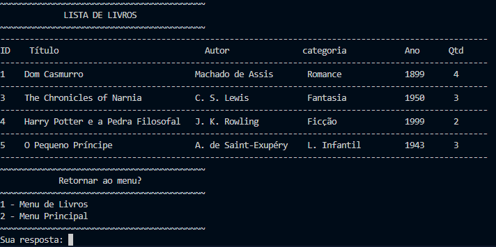

# 📚 Library Management System

A library management system developed in Python using SQLite to manage books, customers, loans, and returns through a command-line interface.

## 🚀 Features

### 📖 Book Management

* Add new books
* List all registered books
* Search books by title, author, category, or publication year
* Edit book information
* Remove books from the catalog

### 👤 Customer Management

* Register new customers
* List registered customers
* Search customers by name, CPF, or phone number
* Update customer information
* Delete customer records

### 🔄 Loan Management

* Create book loans
* Process book returns
* Automatic stock updates
* Loan history tracking
* Loan status management

### 💰 Fine Calculation

* Late return fine calculation
* Damaged book fine calculation

---

## 🛠️ Technologies Used

* Python 3
* SQLite3
* Modular Programming
* Relational Database Management

---

## 📂 Project Structure

```text
library-management-system/
│
├── main.py
├── system/
│   ├── __init__.py
│   ├── book.py
│   ├── customers.py
│   ├── loans.py
│   ├── interface.py
│
├── .gitignore
└── README.md
```

---

## ▶️ Getting Started

### 1. Clone the repository

```bash
git clone https://github.com/GustavoRyouji/sistema-biblioteca-python.git
```

### 2. Navigate to the project folder

```bash
cd sistema-biblioteca-python
```

### 3. Run the application

```bash
python main.py
```

The SQLite database will be created automatically on the first execution.

---

## 🎯 Learning Objectives

This project was developed to practice and improve skills in:

* Python Programming
* SQLite Database Management
* CRUD Operations
* Data Persistence
* Error Handling
* Modular Software Design
* Command-Line Application Development

---

## 📸 Example

Main Menu:

```text
1 - Books
2 - Customers
3 - Loans
4 - Exit
```

---

## Screenshots

### Main Menu



### Books Management



### Loan Management


---

## 👨‍💻 Author

**Gustavo Ferreira**

Systems Analysis and Development Student

Passionate about Python, Data Analysis, Databases, and Software Development.
